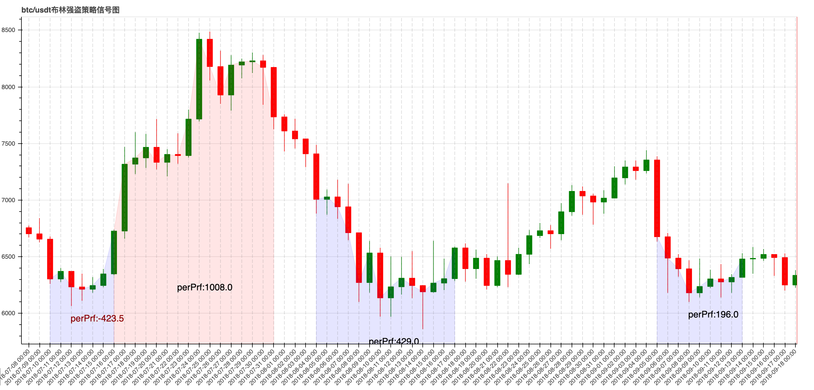

# Bollinger_strategy

[](https://github.com/Kucoin-academy/Guide)
[](https://github.com/Kucoin-academy/bollinger-strategy)
[](https://github.com/Kucoin-academy/bollinger-strategy)
[](https://github.com/Kucoin-academy/bollinger-strategy/issues)

[](README.md)
[](README_CN.md)

## Strategy description

MB middle line: simple moving average of 10 days

UP line: middle line + 1.5x(standard deviation of 30 days)

DN line: middle line - 1.5x(standard deviation of 30 days) 

If the close position breaks up the UP line, open long position, and if price drops down below middle line, close the postion.

If the close position breaks down the DN line, open short position, and if price breaks up middle line, close the postion. 



**The picture above is the simulation operation of the Bollinger strategy, where the blue part represents shorting and the red represents longing, and the width of the area represents the position holding time. In the chronological order, the left represents opening position, and the right represents closing position. The perPrf represents the income of the region, positive numbers indicate profit, negative numbers indicate loss**.

**KuCoin** provides **the transaction data of level 3, great matching engine, and the commission discount specially offers to the API customers**. At the same time, we offer the **sandbox environment** as the data testing support to avoid the risks.

Only a simple and incomplete trading strategy is provided here, so please pay attention to **avoiding risks** when using it. We hope that you can **make test adjustments in the sandbox environment with other parameters or strategies,  as we do not want you to become a philanthropist! ! !**

Surely, if you encounter any problems in this process, or you have a profitable strategy to share, please reflect in **ISSUE**, we will try to respond in a timely manner. 

:point_right: If you are interested in this strategy, please click **the star in the upper right corner**, we will  measure **the popularity of this strategy and subsequent optimization prioritie**s based on the amounts of stars. You can also click **watching in the upper right corner** to continue to follow this project by receiving update notifications. 

## How to use

* Download Python

  * Please download python in [Python](https://www.python.org/) official website for other system requirement(Such as **Windows**), if your computer is 64-bit operating system, please click 1, if it is 32-bit operating system, please click 2.

    

    * Please note the following options when starting the installation:

      

  * For MAC OS X

    * Open terminal and enter the following command to download Homebrew(During the installation, you need to enter the **computer password**):

      ```shell
      /usr/bin/ruby -e "$(curl -fsSL https://raw.githubusercontent.com/Homebrew/install/master/install)"
      ```

    * Enter the following command in terminal to download Python3:

      ```shell
      brew install python
      ```

    * Enter the following command in terminal to confirm if you download successfully:

      ```shell
      python3 --version
      ```

      

* Confirm that you have already downloaded git(Mac OS  already has this software, enther `which git` in terminal to check the path of the file）, if you did not download this software, please do it through the [git](https://git-scm.com/) official website.

* Enter the following command in terminal to install the dependency:

  ```shell script
  pip3 install python-kumex
  ```

  
  
* Create a new folder (such as the desktop) at the location where you need to run the strategy, right click on the newly created folder and select "**Create a new terminal window at the folder location**"(For Windows, right click the folder and select "**git Bash here**"), enter the following command in the pop-up window to clone the project to the local, and a folder **bollinger-strategy** will be added locally after completion:
  
  ```shell
  git clone https://github.com/Kucoin-academy/bollinger-strategy.git
  ```
  
  
  
* Open the (**bollinger-strategy**) project you have cloned,  rename **config.json.example** as **config.json**, using text editor(e.g., **notebook**) to open **config.json**, then add the relevant configuration information: 

  ```
  {  
    "api_key": "api key",
    "api_secret": "api secret",
    "api_passphrase": "api pass phrase",
    // if sandbox
    "is_sandbox": true,
    // contract name, e.g.: XBTUSDM 
    "symbol": "contract name",
    // leverage, e.g.:5
    "leverage": "Leverage of the order",
    // order size, e.g.: 1
    "size": "Order size. Must be a positive number",
    // time frame of Kline, mesure time by minute, e.g.:60(60min)
    "resolution": "kline resolution,count by minute,such as 60,it means 60min(1h) kline",
    // threshold value
    "valve": "valve",
  }
  ```

* Mac/Linux open terminal **in the project directory**: 

  ```shell
  cd bollinger-strategy
  ```
  * Using the following command to run your strategy:
  
    ```shell
    ./bollinger.py
    ```
  
* Windows open terminal **in the project directory**: 

  ```shell
  cd bollinger-strategy
  ```
  * Using the following command to run your strategy:
  
    ```shell
    py bollinger.py
    ```
  
  

